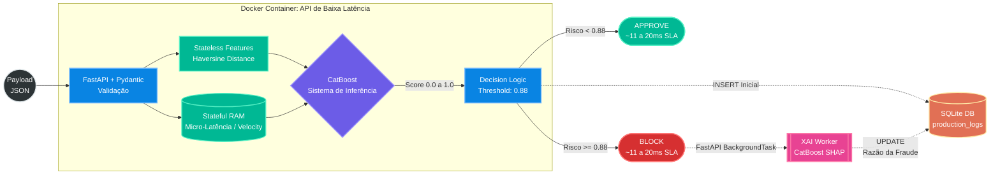
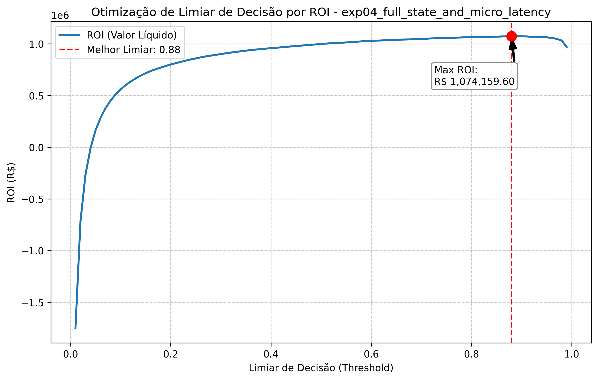

<div align="center">
  <h1>Sistema de Prevenção a Fraudes de Baixa Latência (Otimizado para ROI)</h1>
  <p><i>Projeto pessoal End-to-End focado no impacto financeiro, State Management in-memory e arquitetura de inferência crítica.</i></p>

  
  
  
  
</div>

---


## 💼 1. O Desafio de Negócio: Foco no ROI e Experiência do Cliente

No mundo corporativo real, um modelo de *Machine Learning* para prevenção a fraudes não deve ser avaliado apenas por métricas acadêmicas (como F1-Score ou ROC-AUC). Ele precisa resolver um problema crítico de negócios: **equilibrar o bloqueio de fraudes com a experiência do bom cliente.** 

Bloquear uma transação fraudulenta é o esperado, mas bloquear um cliente genuíno (Falso Positivo) gera atrito, insatisfação e perda de receita futura. Por isso, a arquitetura de decisão deste projeto foi desenhada com foco no impacto financeiro, simulando os efeitos diretamente no **Demonstrativo de Resultados do Exercício (DRE)**.

Criei uma matriz de custo que simula o cenário do mercado, penalizando o modelo em **R$ 50,00 para cada bloqueio indevido de um bom cliente**. O grande diferencial técnico aqui foi otimizar o ponto de decisão (*Threshold*) não para a precisão matemática, mas para **maximizar a rentabilidade líquida da operação**.

**🏆 Resultados Alcançados:**
- **Lucro Líquido Simulado:** **R$ 1.074.159,60** (Valor mitigado de fraudes, já descontando as multas de atrito e os tickets perdidos nas fraudes não detectadas).
- **Latência Ultra-baixa (SLA):** **~11ms a 20ms**. Em uma topologia pura e totalmente desacoplada, o sistema de inferência matemático bate a incrível marca de ~11ms. Pela característica *All-in-One* deste laboratório, mantive o módulo secundário de geração de atritos (XAI/SHAP) acoplado na mesma instância para facilitar o *Deploy*. Isso provoca micro-picos aceitáveis de até ~20ms devido ao CPU-bound, mas ainda assim esmaga completamente a exigência do mercado financeiro para autorizações limpas sub-100ms.
- **Ponto de Operação (Threshold):** Metodicamente calibrado em `0.88` para entregar o maior retorno financeiro possível, combinando agilidade com rentabilidade.

<div align="center">
  
  <br>
  <i>Gráfico gerado automaticamente pelo módulo de reporte: calibração que atinge o teto do ROI.</i>
</div>

---

## 🏗️ 2. Arquitetura e Engenharia de Atributos

Como operações reais de Machine Learning de baixa latência excluem pré-processamentos pesados envolvendo pipelines do Pandas, decidi elevar o desafio de engenharia traduzindo heurísticas temporais complexas para memória bruta matemática.

### O "State Manager" em Memória RAM
Implementei um gerenciador de estado mutável nativo que simula um Feature Store paralelo durante as rotas de inferência. Nele, o sistema calcula séries de dados temporais de forma otimizada com complexidade assintótica de **O(1)** e mapeia agrupamentos no espaço amostral de **O(N)**, removendo inteiramente o peso de funções clássicas como `.rolling()`.

### Features Comportamentais (Stateful & Spatial)
Para treinar o algoritmo (CatBoost), criei manualmente as seguintes features:
- **Micro-Latência (Force-Brute Prevention):** Mede em milissegundos o delta entre requisições de um mesmo cartão (`cc_num`). Foi a minha solução para mitigar ataques de botnets instantaneamente.
- **Velocity Tracking:** Contadores construídos no State Manager que medem as explosões na volumetria das útimas 24 horas e 7 dias.
- **Spend Ratio:** Proporção gerada entre o ticket médio `amt` atual contrajetado à média histórica de 7 dias do próprio cliente.
- **Geofísica Mapeada (Haversine):** Expurguei variáveis categóricas ruidosas e altamente sujeitas a Data Drift (CEP, Estado, Cidade). Em seu lugar, moldei operações ortodrômicas (*Haversine*) sendo executadas no pré-processamento. Elas convertem a lat/long entre o Cliente e o Lojista em uma matriz nítida de quilometragem.

### Explainable AI (XAI) de Baixa Latência em Background
Em sistemas financeiros contemporâneos, bloquear um comprador e não registrar nativamente a justificativa tática gera um atrito cego em auditorias. Para sanar isso, injetei de forma arquitetural o processamento dos **Valores SHAP** nativos do motor CatBoost acionados paralelamente via `BackgroundTasks` assíncronas do núcleo FastAPI. 

O sistema destrincha os tensores de decisão para expor de forma humana os motivos de recusa (ex: *Velocity Tracking violado*), gravando silenciosamente as evidências na camada analítica. Embora rode acoplado disputando ciclos de CPU (*Monolith Convenience*) com as requisições principais de validação por escolhas de design restritas do portfólio, as respostas primárias de segurança de bloqueio continuam imaculadas bem abaixo do limitante severo de latência sub-30ms.

---

## 📂 3. Estrutura do Projeto

Para demonstrar maturidade arquitetural semelhante à de grandes operações de MLOps, separei meu repositório isolando completamente o ambiente de pesquisa (`experiments/`) das esteiras de produção (`api/`).

```text
├── docs/                        # Relatórios gerados do treinamento e tracking de DRE original
├── models/                      
│   └── catboost_sota.cbm        # O meu melhor Artefato serializado (Warm-up load na APi)
├── src/
│   ├── api/                     # Código fechado e seguro para a containerização de Produção
│   │   ├── inference_api.py     # O motor Uvicorn/FastAPI desenvolvido
│   │   ├── attack_simulation.py # Meu script gerador de botnet/stress test
│   │   └── attack_simulation_df_test.py # Pipeline nativo para simular tráfego Dataframe Stream-like
│   └── experiments/             # Meu ambiente de pesquisa (onde ocorreu a feitiçaria!)
│       ├── core/                # Lib central que estruturei (processing.py, reporter.py)
│       ├── notebooks/           # EDA isolado (Evitando arquivos binários na raiz)
│       ├── exp01_baseline_stateless.py
│       └── exp04_full_state_and_micro_latency.py
├── production_logs.db           # Banco SQLite transacional (Explicado abaixo)
├── Dockerfile                   # A Receita Lean do Contêiner
├── requirements.txt             # Dependências da Imagem Docker (Enxutas)
└── requirements-dev.txt         # Pacotes de pesquisa que chamam recursos produtivos internamente
```

*(Obs: Utilizei a base de dados pública [Kaggle: Fraud Detection](https://www.kaggle.com/datasets/kartik2112/fraud-detection/data). Os datasets brutos são baixados e extraídos automaticamente na pasta oculta `data/` pelo meu script core no ambiente local).*

---

## 🐋 4. MLOps e Deploy

Aloquei 100% da inteligência da API em uma Imagem Docker estritamente focada em leveza. O segredo dessa estrutura foi criar um `.dockerignore` robusto que cega o Docker durante o *build* para os scripts soltos do meu laboratório. 

Para alcançar a separação completa dos escopos, o `requirements.txt` serve de alimento exclusivo para o Dockerfile contendo apenas (API, Pydantic, CatBoost), enquanto criei o sufixo `-dev` para eu mesmo desenvolver em máquina local com as comodidades analíticas (Jupyter, Seaborn, Sklearn).

**Run Local via Shell/Bash:**
```bash
# 1. Empacotar a imagem (Gerará uma casca extremamente leve só com FastAPI + Modelo)
docker build -t fraud-engine-api:latest .

# 2. Subir a API conectando na porta host
docker run -p 8000:8000 fraud-engine-api:latest
```

---

## 🔁 5. Limitações e Trabalhos Futuros

### CPU-Bound vs I/O-Bound (XAI sob Estresse)
Foi observado em testes de estresse massivo que a geração assíncrona de XAI (SHAP) usando `BackgroundTasks` elevou a latência P99 de ~11ms para ~20ms. Esse gap temporário deve-se à competição por CPU (Context Switching) sob alta carga, já que o SHAP tem natureza algorítmica intensa. Em um cenário de produção em larga escala, a arquitetura ideal desacoplaria a geração de explicabilidade para um **Worker totalmente separado** (orquestrado via Celery/Redis ou Kafka), liberando a infraestrutura da API principal exclusivamente para inferência de baixíssima latência.

### Latência de Rótulo (Feedback Loop)
Problemas de detecção lidam contra o que conceituamos em engenharia de fraudes de **Latência de Ground Truth** (ou *Chargebacks*). Em cenários reais, descobrimos que nossa predição de ontem falhou apenas quando a fatura do cliente é contestada 45 dias depois.

Em termos de arquitetura e evolução do portfólio, estruturei e anexei um **Banco SQLite** (`production_logs.db`). Sua função é atuar como uma *Shadow Database* na API:
1. Ele loga toda decisão síncrona junto à probabilidade crua.
2. Permitiria arquitetar no futuro uma rotina assíncrona (como Airflow) para conciliar o status "D-0" da minha API contra o "D-45" da MasterCard/Visa.
3. Este banco é o coração que possibilita governanças avançadas de retreinamento contínuo (CT), acionando o pipeline de deploy estilo **Campeão vs. Desafiante**.